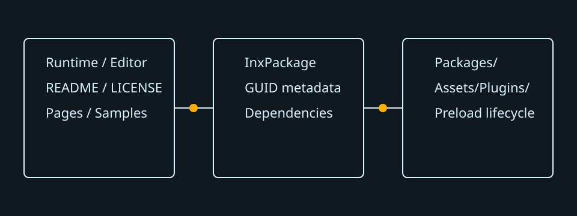

# Infernux Plugin Template

[简体中文](README.zh-CN.md)



This repository is a starting point for an Infernux plugin that contains runtime code, editor tools, documentation, localized pages, and sample assets. Clone it directly into a project when developing, or use **Use this template** to create a standalone repository.

## Quick start

1. Replace `your-studio/example-plugin` in `InxPackage.json` with a globally unique lowercase reference.
2. Rename `Runtime/your_studio/example_plugin` and `Editor/your_studio/example_plugin_editor`, then update the imports and panel `type_id`.
3. Open the repository inside an Infernux project, edit the files, and test the component and editor panel normally.
4. Build the distributable package in the `infernux` environment:

   ```powershell
   conda activate infernux
   python .infernux-dev/build.py
   ```

5. Import `dist/example-plugin.inxpkg` in another project, or install the repository through its Git URL in the Plugins panel.

## Directory guide

```text
infernux-plugin/
├─ InxPackage.json                 package identity, version, engine range, dependencies
├─ requirements.txt               pip requirements and registered plugin references
├─ README.md                       default introduction shown by the Plugins panel
├─ README.zh-CN.md                 Simplified Chinese introduction
├─ LICENSE                         default license page
├─ CHANGELOG.md
├─ CHANGELOG.zh-CN.md
├─ Runtime/
│  └─ your_studio/example_plugin/ player-safe components, APIs, and preload lifecycle
├─ Editor/
│  └─ your_studio/example_plugin_editor/ editor-only panels and authoring tools
├─ InxPluginPages/
│  ├─ Usage.md                     additional information tab
│  ├─ Usage.zh-CN.md               exact zh-CN translation suffix
│  └─ media/                       images referenced by README and information pages
├─ Samples/
│  ├─ Scenes/
│  ├─ Materials/
│  └─ Scripts/                     ordinary assets installed under Assets/Plugins
├─ .infernux-dev/                  local build and validation helpers; not packaged
└─ .github/workflows/              repository validation; not packaged
```

`Runtime/`, `Editor/`, the manifest, README files, license, requirements, and `InxPluginPages/` are controlled package content and install under `Packages/<reference>`. Other top-level content is installed under `Assets/Plugins/<reference>`, so scenes, materials, prefabs, textures, and scripts can travel with the plugin without expanding the project root.

## Manifest example

```json
{
  "reference": "your-studio/example-plugin",
  "name": "Example Plugin",
  "version": "0.1.0",
  "engine": ">=0.3.7,<0.4",
  "dependencies": ["your-studio/foundation"],
  "requirements": "requirements.txt"
}
```

References form namespaces and may contain multiple levels, such as `company/physics/jolt`. Dependencies are resolved through the plugin registry before pip requirements. `requirements.txt` accepts ordinary pip syntax, registered plugin references, and nested `.inxpkg` paths.

## Preload and editor tools

Only classes derived from `InxPreload` are imported early. Use `preload()` to register process-local services or import editor contributions, and use `unload()` to release everything that can be removed without restarting. Runtime builds ignore `Editor/`; the example preload imports its panel only when `context.runtime` is false.

## Localization

English/default content uses the unsuffixed filename. Simplified Chinese uses exactly `.zh-CN`:

- `README.md` and `README.zh-CN.md`
- `Usage.md` and `Usage.zh-CN.md`
- `LICENSE` and optional `LICENSE.zh-CN.md`

Relative images belong beside the documentation or under `InxPluginPages/media/`.
